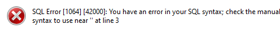
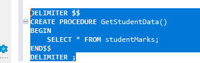
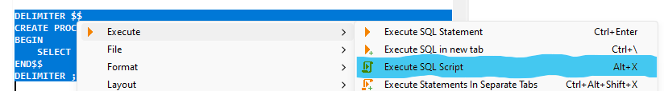
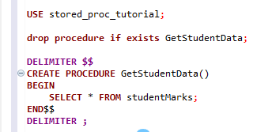

[Read Me](../ReadMe.md) | [Session 16](../session_16/OSS-16-Programming.md) | [Session 18](../session_18/OSS-18-Programming.md)

# Session 17 

| Delivery Mode | Date       |
|---------------|------------|
| Face-to-Face  | 2023-11-15 |
| Online        | 2023-11-22 |

We will attempt to cover items from all the stages. No guarantees... have one item to look at already...

> NB: We have moved the common details to the [[ReadMe]] document.

---

## WARNING ⚠️
No Warnings for this evening... other than background noise as usual.

---

## Session Start
6:30PM but Adrian may be available earlier...
Use the BB9 session chat...

---

## Follow Ups 🦷
- Libraries in Python (Stage 3, Intermediate Programming - Python) 
	- see [[#Stage 3 - Python]]

---
## Questions?!
Get them questions ready!
Subject / Topic and the question itself 😊

---
### Tonight...
- Last Date for submissions
	- Week 19 (6/12/23) for any chance of feedback (By Weds midnight)
	- Week 20 (13/12/23) if not worried about result (By Weds midnight)
	- Little fixes, may have some leeway.
	- Big fixes, much much much harder

- Things are a changing!
	- All face to face lecturers will be involved in online support
	- Dedicated support session(s) for each unit/cluster
	- Day/Time to be determined by lecturer in consultation with students
	- Open to online and face to face

- Need a bit of "peace n quiet"
	- Don't be afraid to ask if you can come into Perth campus for study
	- Send Adrian a Teams message!

- Feedback!
	- Please let us know where you have had problems with the content / assessments
	- **To:** online@screencraft.net.au
	- **Subject:** Continuous Improvement (CLUSTER/UNIT NAME)
	- **Body:** your feedback on structure of shell content, assessments etc.

---

### Stage 1: ...

### Stage 2:  C# / SQL / DDA

#### DDA/SQL

##### Some useful links for SQL/DDA

- MySQL STORED PROCEDURE Tutorial With Examples: https://www.softwaretestinghelp.com/mysql-stored-procedure/ 
- How to Use MySQL Stored Procedures to Simplify Database Operations: https://www.freecodecamp.org/news/how-to-simplify-database-operations-using-mysql-stored-procedures/
- How to Create a Simple MySQL Stored Procedure (YouTube | Database Star): https://www.youtube.com/watch?v=7ReXGwNrw5g
- Learn MySQL: The Basics of MySQL Stored Procedures: https://www.sqlshack.com/learn-mysql-the-basics-of-mysql-stored-procedures/

##### dBeaver hiccup with Stored Procedure Creation

 - It has been noted that dBeaver will not work as expected when defining a Stored procedure using SQL.
	 - If you get an error such as:
		   
		   
	 - Then SELECT the whole query (as shown below) and execute that 'statement' by right clicking the selection, hover over Execute and then select *Execute SQL Script*.
	   
		   
	- Alternatively, use `ALT`+`X` to execute the selected lines:
	   
		   
	- Another item you could do is to drop the procedure before creating the procedure:
	  
	  
	- Example code [SQL Stored Procedure Demo SQL](SQL-Stored-Procedure-Demo.sql)

### Stage 3: ...

### Stage 4: ...

---
